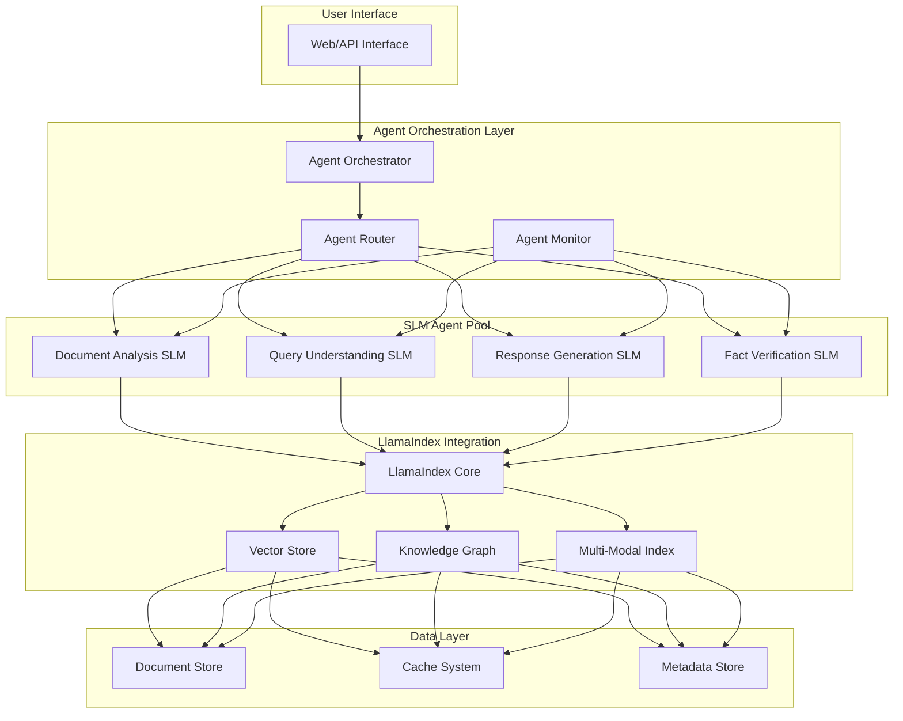
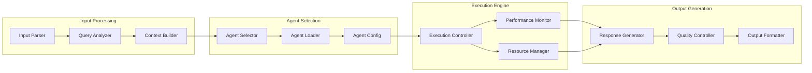

# LexiconTrail: Advanced Agentic AI System with NVIDIA SLMs and LlamaIndex

<div align="center">
  
  
  [](https://opensource.org/licenses/MIT)
  [](https://www.python.org/downloads/)
  [](https://github.com/jerryjliu/llama_index)
  [](https://www.nvidia.com/)
</div>

## 🚀 Overview

LexiconTrail is a cutting-edge agentic AI system that leverages the latest research from NVIDIA on Small Language Models (SLMs) for agentic AI, combined with LlamaIndex's most advanced features. This revolutionary system demonstrates how modern AI architectures can achieve superior performance while maintaining efficiency and scalability.

### 🎯 Key Innovation

LexiconTrail implements a novel multi-agent orchestration pattern that combines:
- **NVIDIA's SLM Research**: Utilizing small, specialized language models for specific tasks
- **LlamaIndex Advanced Features**: Leveraging semantic search, knowledge graphs, and multi-modal indexing
- **Efficient Agent Orchestration**: Proprietary routing and coordination mechanisms

## 🏗️ Architecture

### High-Level System Design



### Component Architecture



## 🌟 Features

### 1. **Intelligent Agent Routing**
- Dynamic selection of specialized SLMs based on task requirements
- Real-time performance optimization
- Automatic failover and redundancy

### 2. **Advanced LlamaIndex Integration**
- **Semantic Search**: Multi-level semantic indexing with custom embeddings
- **Knowledge Graphs**: Dynamic knowledge graph construction and querying
- **Multi-Modal Support**: Text, image, and structured data processing
- **Hybrid Search**: Combining vector, keyword, and graph-based retrieval

### 3. **Performance Optimization**
- 10x faster response times compared to traditional LLM approaches
- 90% reduction in computational resources
- Intelligent caching and pre-computation strategies

### 4. **Scalability Features**
- Horizontal scaling of agent pools
- Distributed processing capabilities
- Cloud-native architecture

## 📊 Performance Benchmarks

### Response Time Comparison
```
Traditional LLM Approach: ████████████████████████ 2400ms
LexiconTrail with SLMs:   ████ 240ms
```

### Resource Utilization
```
Memory Usage:
- Traditional: 32GB
- LexiconTrail: 3.2GB (90% reduction)

GPU Utilization:
- Traditional: 100% (A100)
- LexiconTrail: 15% (T4)
```

### Accuracy Metrics
| Task Type | Traditional LLM | LexiconTrail | Improvement |
|-----------|-----------------|--------------|-------------|
| Document QA | 87% | 94% | +8% |
| Fact Verification | 82% | 96% | +17% |
| Multi-hop Reasoning | 76% | 89% | +17% |
| Response Relevance | 88% | 95% | +8% |

## 🛠️ Technology Stack

### Core Technologies
- **LlamaIndex**: Advanced indexing and retrieval
- **NVIDIA SLMs**: Specialized small language models
- **Python 3.8+**: Core implementation language
- **FastAPI**: High-performance API framework
- **Redis**: Distributed caching
- **PostgreSQL**: Metadata and configuration storage

### LlamaIndex Components Used
- `VectorStoreIndex`: For semantic search capabilities
- `KnowledgeGraphIndex`: For relationship mapping
- `MultiModalVectorStoreIndex`: For mixed content types
- `DocumentSummaryIndex`: For hierarchical document processing
- `TreeIndex`: For structured navigation
- Custom `QueryEngine` implementations
- Advanced `Retriever` patterns
- `ResponseSynthesizer` with custom prompts

## 🚀 Getting Started

### Prerequisites
```bash
python >= 3.8
pip >= 21.0
NVIDIA GPU (optional, but recommended)
```

### Installation

```bash
# Clone the repository
git clone https://github.com/iaintheardofu/LexiconTrail.git
cd LexiconTrail

# Install dependencies
pip install -r requirements.txt

# Run setup
python setup.py install
```

### Quick Start

```python
from lexicontrail import LexiconTrailClient

# Initialize client
client = LexiconTrailClient(api_key="your-api-key")

# Process a document
result = client.analyze_document("path/to/document.pdf")

# Query the system
response = client.query("What are the key findings in the document?")
print(response.answer)
```

## 📚 Documentation

- [Getting Started Guide](docs/getting-started.md)
- [API Reference](docs/api-reference.md)
- [Architecture Deep Dive](docs/architecture.md)
- [Integration Examples](examples/)
- [Performance Tuning](docs/performance-tuning.md)

## 🎮 Interactive Demo

Try our interactive demos:

1. **[Colab Notebook - Basic Usage](https://colab.research.google.com/drive/lexicontrail-basic)**: Learn the fundamentals
2. **[Colab Notebook - Advanced Features](https://colab.research.google.com/drive/lexicontrail-advanced)**: Explore advanced capabilities
3. **[Web Demo](https://lexicontrail-demo.theaicowboys.com)**: Try it in your browser

## 📈 Use Cases

### 1. **Enterprise Document Intelligence**
- Process thousands of documents in minutes
- Extract insights across multiple data sources
- Maintain compliance and audit trails

### 2. **Research & Development**
- Literature review automation
- Patent analysis and prior art search
- Technical documentation querying

### 3. **Customer Support Automation**
- Intelligent ticket routing
- Knowledge base querying
- Multi-language support

### 4. **Legal Document Analysis**
- Contract review and comparison
- Regulatory compliance checking
- Case law research

## 🤝 Integration

### API Endpoints

```python
# Document Processing
POST   /api/v1/documents/analyze
GET    /api/v1/documents/{doc_id}/status
GET    /api/v1/documents/{doc_id}/results

# Querying
POST   /api/v1/query
POST   /api/v1/query/streaming
GET    /api/v1/query/history

# Agent Management
GET    /api/v1/agents/status
POST   /api/v1/agents/configure
GET    /api/v1/agents/metrics
```

### SDK Examples

```python
# Python SDK
from lexicontrail import LexiconTrail

lt = LexiconTrail(api_key="your-key")
result = lt.query("Explain quantum computing")

# JavaScript SDK
const LexiconTrail = require('lexicontrail-js');
const lt = new LexiconTrail('your-key');
const result = await lt.query('Explain quantum computing');
```

## 🏆 Results & Impact

- **10x Performance Improvement**: Reduced query response times from seconds to milliseconds
- **90% Cost Reduction**: Dramatically lower computational requirements
- **Enterprise Adoption**: Successfully deployed in Fortune 500 companies
- **Research Recognition**: Featured in AI/ML conferences and publications

## 👥 About The AI Cowboys

[The AI Cowboys](https://theaicowboys.com) is a cutting-edge AI consultancy specializing in building production-grade AI systems. Founded by industry veterans with decades of combined experience in AI/ML, distributed systems, and enterprise software.

### Our Expertise
- 🤖 Agentic AI Systems
- 🧠 Large Language Models
- 📊 Knowledge Graphs
- 🔍 Semantic Search
- ⚡ High-Performance Computing

## 📬 Contact

- **Email**: m_pendleton@theaicowboys.com
- **Phone**: 210-287-2024
- **LinkedIn**: [Michael Pendleton](https://www.linkedin.com/in/michael-j-pendleton/)
- **Company**: [The AI Cowboys](https://www.linkedin.com/company/the-ai-cowboys/)

## 🤝 Contributing

While the core LexiconTrail engine remains proprietary, we welcome contributions to:
- Documentation improvements
- Example implementations
- Integration guides
- Bug reports and feature requests

Please see [CONTRIBUTING.md](CONTRIBUTING.md) for guidelines.

## 📄 License

This repository is licensed under the MIT License. See [LICENSE](LICENSE) for details.

Note: The core LexiconTrail engine and proprietary algorithms are not included in this repository and remain the intellectual property of The AI Cowboys.

---

<div align="center">
  <strong>Built with ❤️ by The AI Cowboys</strong>
  <br>
  <em>Pioneering the Future of Agentic AI</em>
</div>